# Lineage 2M Discord Text Boss Notifier Ru
[English Verison - Lineage 2M Discord Text Boss Notifier En](https://github.com/DarkDesire/lineage2m-discord-text-notifier-bot-en)
 Дата обновления бота: 2023-04-13
 
 
Текстовый бот Lineage 2M, оповещает о респаунах боссов в Discord 
 ! Также есть и голосовая версия бота !
  * Не требователен к железу. Достаточно python на сервере.

## Как установить? 
В самом конце гайда ...

## Доступный функцоинал бота:
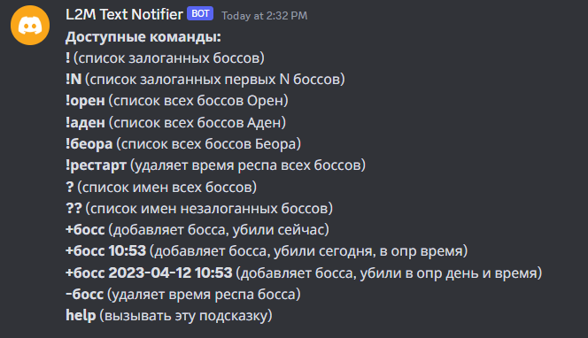

## Атоматически. Каждые 5 минут напоминает о ближайших боссах
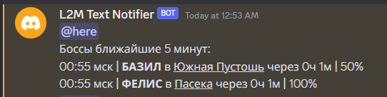
 Автоматически продляет респ у босса
 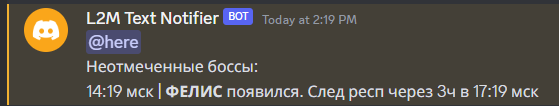

### **<> Комманда !**
Если нет боссов, показывает уведомление
 
 Если есть залоганные боссы, показывает их в порядке респа
 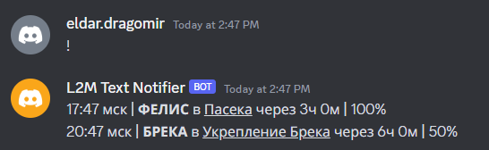

### **<> Команда !N**
Показывает ближайших N залоганных боссов
 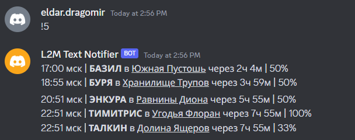

### **<> Команда !беора**
Показывает все распаупы боссов Беоры.
 Есть также для Орен, Гиран, Аден
 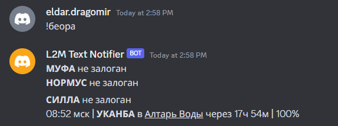

### **<> Команда !рестарт**
Обнуляет респаун __всех__ боссов. Полезно после рестарта.
 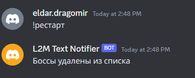

### **<> Команда ?**
Показывает имена __всех__ боссов.
 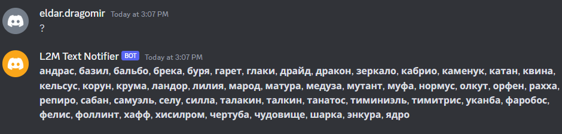

### **<> Команда ??**
Показывает имена __всех__ незалоганных боссов.
 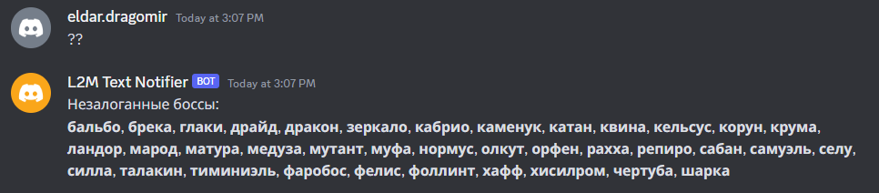

### **<> Команда +босс**
Можно добавлять различными способами. Не обязательно указывать имя босса целиком и правильно.
 Можно указать время в прошлом, если известно, с помощью формата полного дня.
 Можно указать время смерти только в часовом формате.
 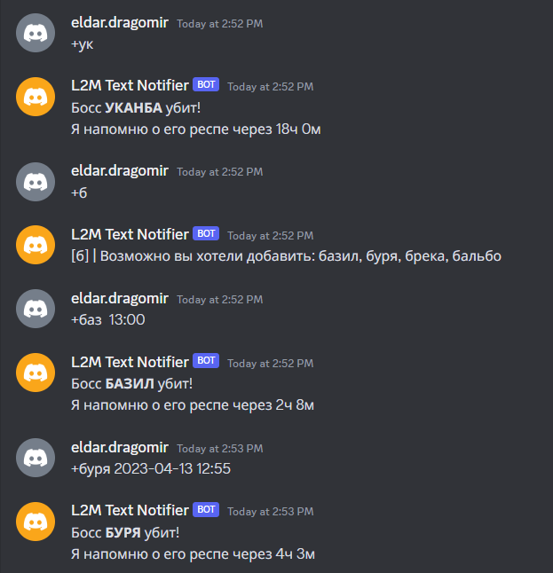

### **<> Команда -босс**
Удаляет одного босса из респауна.
 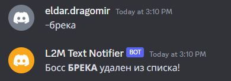

### **<> Команда help**
 Появляется всегда при неудачном вводе команды или при вызове этой команды
 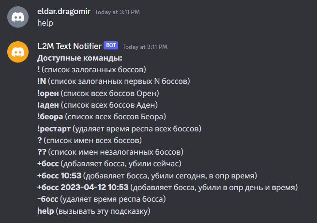

## Как установить? 
**! Весь код в этом репозитории !**
> Вам достаточно знать Python и посмотреть документацюи по боту от Discord, чтобы все сделать самостоятельно.

**Если не хотите заниматься установкой вручную, я помогу вам запустить на вашем сервере за _donation_ (50€)**
 _У меня есть скрипты, как для запуска на слабых машинах, так и для запуска контейнером в Docker._

## Мои контакты:
- [Instagram](https://www.instagram.com/eldar.dragomir/)
- [Telegram](https://t.me/eldar_dragomir)