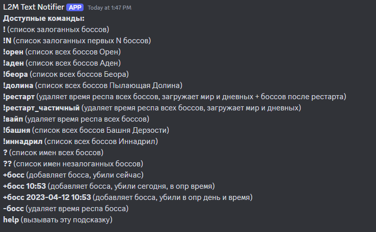
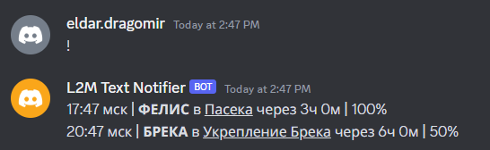
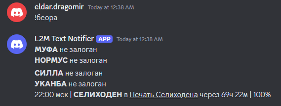
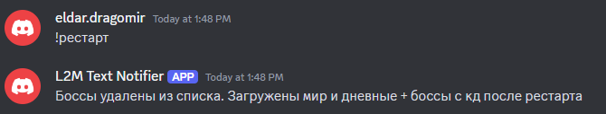
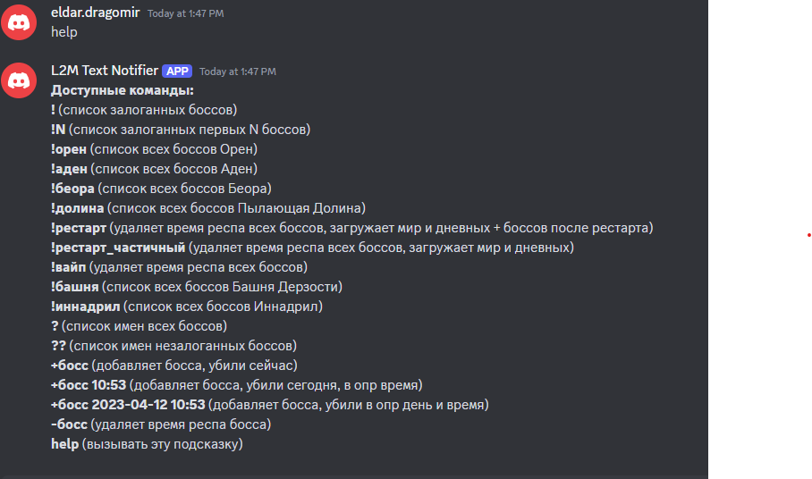

# Lineage 2M Discord Text Boss Notifier Ru
> If you need an English version, send me a private message. Contact details are below. The bot is paid.

 Дата обновления бота: 2024-08-29
 
 
## Текстовый бот Lineage 2M, оповещает о респаунах боссов в Discord 
  [x] Не требователен к железу. Достаточно python на сервере.
  [x] **Платный. 50евро или 5тр**
  (_Также есть и голосовая версия бота (за отдельную плату)_)

## Последние обновления:
 __2024-08-26__ По команде !рестарт, теперь сразу добавляются боссы ежедневные, мировые, и боссы с начальным респом (типа Ant Queen, танатос, феникс и прочих)
 __2024-08-29__ Бота можно перезапустить через сайт, не нужно больше знание консоли и доступа к сервер

## Доступный функцоинал бота:

## Атоматически. Каждые 5 минут напоминает о ближайших боссах

 Автоматически продляет респ у босса
 

### **<> Комманда !**
Если нет боссов, показывает уведомление
 
 Если есть залоганные боссы, показывает их в порядке респа
 

### **<> Команда !N**
Показывает ближайших N залоганных боссов
 

### **<> Команда !беора**
Показывает все распаупы боссов Беоры.
 Есть также для Аден, Пылающая Долина, Башня Дерзости.. смотри help.
 

### **<> Команда !рестарт**
Обнуляет респаун __всех__ боссов. Добавляет сразу ежедневные и мировые.
 

### **<> Команда !вайп**
Для уверенных в себе, обнуляет __всех__ боссов. Вы начинаете с полного нуля.
 

### **<> Команда ?**
Показывает имена __всех__ боссов.
 

### **<> Команда ??**
Показывает имена __всех__ незалоганных боссов.
 

### **<> Команда +босс**
Можно добавлять различными способами. Не обязательно указывать имя босса целиком и правильно.
 Можно указать время в прошлом, если известно, с помощью формата полного дня.
 Можно указать время смерти только в часовом формате.
 

### **<> Команда -босс**
Удаляет одного босса из респауна.
 

### **<> Команда help**
 Появляется всегда при неудачном вводе команды или при вызове этой команды
 

---

## Мои контакты:
- [Instagram](https://www.instagram.com/eldar.dragomir/)
- [Telegram](https://t.me/eldar_dragomir)
